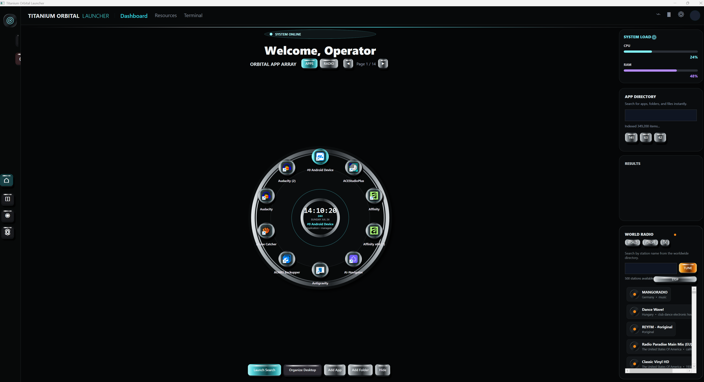

# Titanium Orbital Launcher



Titanium Orbital Launcher is a Windows desktop command center built around a physical, rotating orbital interface. It combines application and folder launching, indexed search, worldwide internet radio, a 24-hour clock, animated wallpaper support, and an optional desktop-organizing library.

The visual language is inspired by precision equipment: brushed titanium rings, knurled 3D controls, recessed black surfaces, cyan-anodized active states, and restrained amber status lighting.

## Highlights

- Rotating ten-position orbit for favorite applications, folders, files, and radio stations
- Audible mechanical detents while rotating the ring
- True 24-hour clock with seconds and `dd/MM/yyyy` date display
- Worldwide radio directory with World, Europe, and UK filters
- Live radio playback and animated synthesizer-style level monitor
- Search across Start Menu shortcuts, desktop entries, fixed drives, and common document/media types
- Add App and Add Folder controls for personalizing the orbit
- Custom JPG, PNG, BMP, GIF, or WebP backgrounds with subtle motion
- Titanium, stainless-steel, knurled, cyan-anodized, and amber 3D control treatments
- Optional desktop organization into Shortcuts, Folders, and Files libraries

## Platform

- Windows 10 or Windows 11
- [.NET 10 SDK](https://dotnet.microsoft.com/download/dotnet/10.0) to build from source
- Internet access for world-radio discovery and streaming

This is a WPF application targeting `net10.0-windows`.

## Quick installation

Open PowerShell in the repository folder and run:

```powershell
Set-ExecutionPolicy -Scope Process Bypass
.\scripts\install.ps1
```

The script publishes a Release build into `publish/win-x64` and creates a **Titanium Orbital Launcher** shortcut on the current user's Desktop.

For manual build, portable publishing, and removal instructions, see [Installation](docs/INSTALLATION.md).

## Using the launcher

1. Select **Apps** or **Radio**.
2. Drag around the orbital ring to rotate it. The item facing the hub becomes active.
3. Click an app/folder node to open it, or click a radio node to tune the station.
4. Use **Add App** and **Add Folder** to add favorites.
5. Use **Background** to choose your own image or animated GIF/WebP.
6. Search the indexed catalog from the right-hand directory panel.

The full guide explains orbit paging, search, radio, backgrounds, storage paths, and desktop organization: [Usage guide](docs/USAGE.md).

## Where your apps and files are stored

Favorites and the selected background path are saved locally in:

```text
%LOCALAPPDATA%\DesktopOrbit\settings.json
```

If you deliberately select **Organize Desktop**, the launcher creates:

```text
%USERPROFILE%\Documents\Desktop Orbit Library\
|-- Shortcuts\
|-- Folders\
`-- Files\
```

> [!CAUTION]
> **Organize Desktop moves items; it is not merely a visual grouping command.** Back up important desktop content first and close files currently in use. Windows system locations are excluded from indexing, but users remain responsible for their own files.

## Themes and backgrounds

The bundled theme uses a deep-black foundation, brushed metal, knurled cylindrical controls, cyan active lighting, and amber radio accents. Background images are composited behind a dark readability layer and animated with a slow cinematic drift.

See [Theming and backgrounds](docs/THEMING.md) for recommended image dimensions, formats, composition, and contrast.

## Radio directory notice

Station discovery uses the community-operated [Radio Browser](https://www.radio-browser.info/) directory. Stream URLs, formats, regional availability, and uptime belong to their respective station operators and can change without notice. Titanium Orbital Launcher does not host or redistribute radio content.

## Project structure

```text
DesktopOrbit/
|-- Assets/                 # Wallpaper and launcher artwork
|-- Converters/             # WPF binding converters
|-- Models/                 # Apps, radio stations, settings, orbit nodes
|-- Services/               # Indexing, persistence, desktop library
|-- ViewModels/             # Clock, orbit, search, and radio state
|-- docs/                   # Installation, usage, and visual guide
|-- scripts/                # Windows install/uninstall helpers
|-- MainWindow.xaml         # Titanium interface
`-- MainWindow.xaml.cs      # Interaction, audio, wallpaper, playback
```

## Privacy and security

- Favorites and preferences remain in the current Windows profile.
- No account is required to use the launcher.
- Search indexing reads accessible filenames and paths on fixed drives; it does not upload the index.
- Radio search sends station queries and region filters to the Radio Browser API.
- Only add applications, scripts, and shortcuts you trust. Launching an item executes it with the current user's permissions.

## Status

This repository is a design-forward working prototype and portfolio showcase. Test it with copies of non-critical files before relying on Desktop Organizer in a production workflow.

## Creator

Created and maintained by [@debattistacliff-commits](https://github.com/debattistacliff-commits).

## License

Copyright is retained by the creator. No open-source license has been granted; see [LICENSE](LICENSE).
